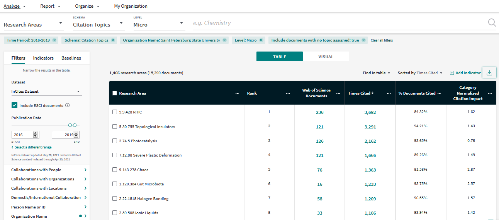
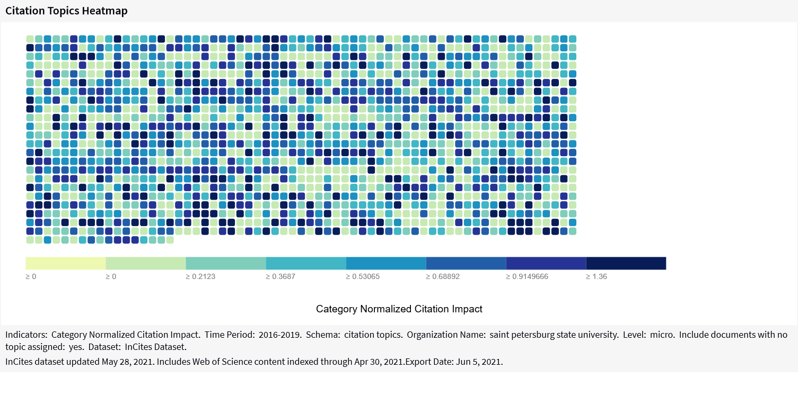
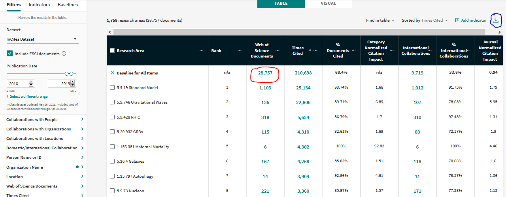

```{r eval=TRUE, message=FALSE, warning=FALSE, include=FALSE, echo=TRUE}
knitr::opts_chunk$set(
	echo = TRUE,
	message = FALSE,
	warning = FALSE
)

Sys.setlocale("LC_CTYPE","russian")
Sys.setlocale("LC_COLLATE","russian")
Sys.setlocale("LC_TIME", "russian")

library(tidyverse)
library(scales)
library(DT)
library(extrafont)
library(sunburstR)
library(htmltools)
library(d3r)
library(crosstalk)
library(plotly)

onedrive <- list.dirs("C:/Users", recursive = FALSE) %>% 
  .[grepl("alexe|WD|lutay",.)] %>% list.dirs(., recursive = FALSE) %>% 
  .[grepl("onedrive",., ignore.case = TRUE)]

## dir for source materials
dir <- "D://Data/incites_msu_spbu/"

## create dir for images (blog)
img_dir <- paste0(getwd(), "/images/")
if(!dir.exists(img_dir)){dir.create(img_dir)}
```

<style>
.d2b-sunburst-breadcrumb .d2b-sunburst-value, .d2b-sunburst-tooltip .d2b-sunburst-value {
  font-size: 12pt;
}

.d2b-sunburst-breadcrumb .d2b-sunburst-label, .d2b-sunburst-tooltip .d2b-sunburst-label {
  text-align: left;
  line-height: 1.1em;	
}
.d2b-chart-frame .d2b-breadcrumbs-frame.d2b-vertical.d2b-breadcrumbs-frame, .d2b-chart-frame .d2b-legend-frame.d2b-vertical.d2b-breadcrumbs-frame {
width: 250px;
}

.d2b-breadcrumbs .d2b-breadcrumb:first-child .d2b-breadcrumb-icon::after, .d2b-breadcrumbs .d2b-breadcrumb:last-child .d2b-breadcrumb-icon::after {
height: 13px;
height: 28px;
}
</style>

In December 2020 Clarivate Analytics announced a new InCites feature - the [citation topics](https://markets.businessinsider.com/news/stocks/clarivate-report-highlights-importance-of-evolution-in-data-categorization-to-promote-responsible-research-metrics-1030065171?op=1) - developed in collaboration with the Centre for Science and Technology Studies (CWTS) at Leiden University (NL). 

The topics are the clusters derived from the Web of Science citation network. According to the [available information](https://incites.help.clarivate.com/Content/Research-Areas/citation-topics.htm):

- the topics are grouped to 3-level hierarchy with 10 (Macro) > 326 (Meso) > 2444 (Micro) entities

- an article can be assigned either to 1 topic, or to none

The hierarchy is also provided, the [current version](https://incites.help.clarivate.com/Content/Resources/Docs/citation-topics-02-26-21.xlsx) is dated as of 26 Feb 2021.

In this post I will try to use the citation topics to look into 2016-2019 publications of 2 largest Russian universities - [Moscow State University](https://en.wikipedia.org/wiki/Moscow_State_University) and [Saint-Petersburg State University](https://en.wikipedia.org/wiki/Saint_Petersburg_State_University).

```{r message=FALSE, warning=FALSE}
## here is a theme for ggplot, it uses the external fonts 
## and requires {extrafont} package and the fonts to be installed

my_theme <- theme_classic()+
  theme(text=element_text(family="PT Sans", 
                          color = "#53565A", size = 12),
        panel.grid.major = element_line(size=0.1, 
                          linetype = 2, color="grey70"),
        panel.grid.minor = element_blank(),
        axis.line = element_line(size = 0.3, 
                          linetype = 1, color = "grey10"),
        axis.ticks = element_line(size=0.3, 
                          linetype = 1, color="grey10"),
        axis.text = element_text(size = rel(0.9)),
        axis.title = element_text(size = rel(1.1), family="PT Sans Narrow"),
        legend.title = element_text(size=rel(1), color="grey10"),
        legend.text = element_text(size=rel(0.9), color="grey10"),
        legend.position = "bottom",
        legend.background = element_rect(size = 0.1, 
                                         color = "grey90", fill = "#fff7fb"),
        legend.box.margin = margin(10,0,10,0),
        legend.box.spacing = unit(0,"cm"),
        plot.caption.position = "plot",
        plot.caption = element_text(size = rel(0.9), hjust=1, 
                                    color = "#969696"),
        plot.subtitle = element_text(hjust=0, size = rel(1), 
                                     family="PT Sans Narrow"),
        plot.title.position = "plot",
        plot.title = element_text(size=rel(1.2), family="PT Sans", 
                                  face="bold", color = "#253494"),
        plot.margin = margin(5, 5, 5, 5),
        strip.background = element_rect(fill = "white", 
                                        colour = "white",  size = 0),
        strip.text = element_text(size = rel(1), 
                                  colour = "#52422F", family = "PT Sans Narrow", 
                                  face = "bold", margin = margin(3,0,3,0), 
                                  hjust = 0.01, vjust = 1))
```

### InCites Built-in Functionality

InCites allows to split the publications (which in our case are the university output) into the sets corresponding to the citation topics of specified level, and analyze it further using an interactive table. So it takes just few clicks to see the most cited or most prolific citation topics of the university (below).

```{r echo=FALSE, message=FALSE, warning=FALSE, fig.cap = 'Screenshot of the Analyze interface of InCites (05 June 2021). Open the image in new tab to see the details in full scale.'}

```

In addition to the table InCites offers a number of chart types (below).

```{r echo=FALSE, message=FALSE, warning=FALSE, fig.cap='Screenshot of the citation topics heatmap in InCites (05 June 2021). Open the image in new tab to see the details in full scale.'}

```

What I am personally missing in InCites is an ability to benchmark few institutions and spot their strong & unique citation topics. Most instruments focus on finding the similarities of the items (collaborators / experts / peer reviewers), but in some cases the institution's unique R&D features need to be highlighted.

Is it due to Clarivate's understanding that there can't be no universal UI, or is this just a part of strategy, but InCites also provides an option to export the underlying publication data, so anyone can take the data and build its own visualization.

### Data 

In order to analyze the citation topics in 2016-2019 publications of MSU and SPbU, I did the following steps: 

- opened the InCites > Analyze > Research Areas interface.

- set the Citation Topics as Schema and Micro as Level.

- applied the filters for Organization Name & the Publication Date,

- added the Baseline for All Items (Baselines tab).

The results (see the picture below) were exported on June 5, 2021 in 2 different ways:

(1) as summary (follow the blue mark),   

(2) as a dataset of publications with the citation topics (follow the red mark).

```{r echo=FALSE, message=FALSE, warning=FALSE, fig.cap='Screenshot of the InCites Analyze interface used for data collection (05 June 2021). Open the image in new tab to see the details in full scale.'}

```

### Benchmarking by number of topics

```{r eval=TRUE, message=FALSE, warning=FALSE, include=FALSE}
hier <- paste0(dir, "citation-topics-02-26-21.xlsx") %>% 
  readxl::read_xlsx(skip = 1) %>%   
  rename(level1 = `Macro ID`, level1_label = `Macro-topic name`, 
                 level2 = `Meso ID`, level2_label = `Meso-topic name`, 
                 level3 = `Micro ID`, level3_label = `Micro-topic name`) %>% 
  unite(col = level3, c(level1, level2, level3), sep=".", remove = FALSE) %>%
  unite(col = level2, c(level1, level2), sep=".", remove = FALSE) %>% 
  unite(col = level1_label, c(level1, level1_label), sep=" ", remove = FALSE) %>% 
  unite(col = level2_label, c(level2, level2_label), sep=" ", remove = FALSE) %>%
  unite(col = level3_label, c(level3, level3_label), sep=" ", remove = FALSE)
  
msu_sum <- paste0(dir, "msu_summaries_2016_2019.csv") %>% 
  read_csv() %>% 
  filter(!grepl("^Baseline", Name)) %>% 
  filter(!is.na(`Web of Science Documents`))

spbu_sum <- paste0(dir, "spbu_summaries_2016_2019.csv") %>% 
  read_csv() %>% 
  filter(!grepl("^Baseline", Name)) %>% 
  filter(!is.na(`Web of Science Documents`))

univ_summaries <- bind_rows(
  msu_sum %>% mutate(univ = "MSU"),
  spbu_sum %>% mutate(univ = "SPbU")
  )  %>%   
  select(univ, topic = Name, 
         n_pubs = `Web of Science Documents`, 
         cites = `Times Cited`, 
         cited_share = `% Docs Cited`, 
         cnci = `Category Normalized Citation Impact`, 
         share_intern_collab = `% International Collaborations`) %>% 
  mutate_at(3:7, ~ifelse(.x=="n/a", NA_real_, as.numeric(.x)))

notopic_msu <- msu_sum$`Web of Science Documents`[msu_sum$Name=="No Topic assigned"]
notopic_spbu <- spbu_sum$`Web of Science Documents`[spbu_sum$Name=="No Topic assigned"]
msu_pubs_total <- sum(msu_sum$`Web of Science Documents`, na.rm = TRUE)
spbu_pubs_total <- sum(spbu_sum$`Web of Science Documents`, na.rm = TRUE)
```

Out of `r number(msu_pubs_total)` MSU publications, `r number(notopic_msu)` (`r percent(notopic_msu/msu_pubs_total,1)`) are not assigned to any topic. For SPbU a number of unassigned articles is a bit higher - `r number(notopic_spbu)` out of `r number(spbu_pubs_total)` (`r percent(notopic_spbu/spbu_pubs_total,1)`). 

A part of those articles are not assigned to any citation topic simply because they haveno connections in the Web of Science citation graph. If an article is not cited by other WoS documents and does not refer to any WoS documents, then the clustering algorithms ignore it. But this is not an only explanation, of course. 

As a number of unassigned articles is substantially higher for the latest years, one can conclude that they were uploaded into Web of Science after the current citation topics had been calculated. Many of them are likely to be assigned to some topics next year with the topics update. In this post the unassigned articles are ignored.

```{r echo=FALSE, message=FALSE, warning=FALSE, out.height= 4, out.width=8}
chart_filename <- paste0(getwd(), "/images/by_n_topics.png")

if(!file.exists(chart_filename)){
  tb1<- univ_summaries %>% group_by(univ) %>% 
    summarize(
      `number_of_topics` = n_distinct(topic), 
      `...with 5 or more pubs` = sum(n_pubs>=5, na.rm = TRUE),
      `...with 10 or more pubs` = sum(n_pubs>=10, na.rm = TRUE),
      `...with 25 or more pubs` = sum(n_pubs>=25, na.rm = TRUE),
      `...with % int.collab < 25% & min 5 pubs` = 
        sum(share_intern_collab<=25 &n_pubs>=5, na.rm = TRUE),
      `...with % int.collab > 75% & min 5 pubs` =
        sum(share_intern_collab>=75 &n_pubs>=5, na.rm = TRUE)
      ) %>% 
    pivot_longer(-c(1), names_to = "category", values_to = "count") 
  
  tb1$category <- factor(tb1$category, 
              levels = c("number_of_topics",
                         "...with 5 or more pubs", 
                         "...with 10 or more pubs",
                        "...with 25 or more pubs",
                      "...with % int.collab < 25% & min 5 pubs",
                      "...with % int.collab > 75% & min 5 pubs"))
  
  tb1 %>% 
    mutate(label = ifelse(count/2444<0.1, 
                          paste0(count, " [",percent(count/2444, 0.1),"]"),
                          paste0(count, " [",percent(count/2444, 1),"]"))) %>% 
    ggplot() + 
    geom_col(aes(x = count, y = univ, fill = univ), 
             position = "identity")+
    geom_label(aes(x = count + 10, y = univ, label = label), 
              color = "grey20", 
              label.padding = unit(0.25, "lines"),
              label.r = unit(0.1, "lines"), label.size = 0,
              size = 3.4, hjust = 0, vjust = 0.5)+
    facet_wrap(~category, ncol = 2)+
    scale_x_continuous(expand = expansion(add=c(0,NA)), 
                       limits = c(0,2400))+
    scale_fill_manual(name = "University", 
                      values = c("MSU"="#0772A8", "SPbU"="#D90479"))+
    labs(title = 'Number of Citation Topics in 2016-19 Publications of MSU and SPbU', 
         subtitle = paste0("Each publication is assigned to a single citation topic, ",
                           "[share %, out of total number of citation topics]."
                           ) %>%  str_wrap(120), 
         caption = paste0("Date: ", format(Sys.time(), '%d.%m.%Y'),
                          "\nData: InCites (Clarivate)"),  x = NULL, y = NULL) +
    guides(fill = guide_legend(title = NULL, reverse = TRUE))+
    my_theme+
    theme(axis.ticks.y = element_blank(), axis.text.y = element_blank())+
    ggsave(chart_filename,  width = 18, height = 12, dpi = 400, units = "cm")
}
knitr::include_graphics(chart_filename)

```

The picture above tells us that there are 1758 citation topics in 2016-2019 publications of MSU, which is 72% of all existing citation topics. For SPbU there is a lower number of topics - 1466 (60%). Counting only the larger topics (i.e. with at least N publications in 2016-2019) does not change an expected dominance of MSU - as a larger organization MSU produced the publications assigned to a wider range of topics. A number of topics with at least 25 articles for MSU (255) is twice as high as for SPbU (126).

A comparable ratio is observed for the topics with at least 5 articles and low share of the international collaborators - such topics can be regarded as local competences - 503 topics in MSU publications and 263 in SPbU publications. What is surprising that a number of topics with at least 5 publications in 2016-2019 and high international collaboration share (>75%) is a bit higher for SPbU (55) than for MSU (43).

### Benchmarking by number of unique topics

The picture above says nothing about how the citation topics present in the publications of 2 universities overlap, and which topics are unique. For convenience I will call the topic "unique", if it is present in a portfolio of one university (with at least 3 articles) and absent (less than 3 or none articles) in a portfolio of the other. Let's have a look at such topics in 2016-2019 publications of MSU and SPbU.

```{r echo=FALSE, fig.height=4, fig.width=8, message=FALSE, warning=FALSE}
unique_topics <- 
  univ_summaries %>% filter(n_pubs>2) %>% 
  add_count(topic) %>% 
  mutate(univ = ifelse(n==1, paste0("only ", univ), "both univs")) %>%
  filter(univ!="both univs") %>% 
  mutate(level3 = str_extract(topic, "^\\d+\\.\\d+\\.\\d+")) %>% 
  left_join(hier) 

chart_filename2 <- paste0(getwd(), "/images/by_n_unique_topics.png") 
if(!file.exists(chart_filename2)){

tb2<- unique_topics %>% 
  group_by(univ) %>% 
 summarize(
      `number_of_topics` = n_distinct(topic), 
      `...with 5 or more pubs` = sum(n_pubs>=5, na.rm = TRUE),
      `...with 10 or more pubs` = sum(n_pubs>=10, na.rm = TRUE),
      `...with 25 or more pubs` = sum(n_pubs>=25, na.rm = TRUE),
      `...with % int.collab < 25% & min 5 pubs` = 
        sum(share_intern_collab<=25 &n_pubs>=5, na.rm = TRUE),
      `...with % int.collab > 75% & min 5 pubs` =
        sum(share_intern_collab>=75 &n_pubs>=5, na.rm = TRUE)
      ) %>% 
    pivot_longer(-c(1), names_to = "category", values_to = "count") 
  
  tb2$category <- factor(tb2$category, 
              levels = c("number_of_topics",
                         "...with 5 or more pubs", 
                         "...with 10 or more pubs",
                        "...with 25 or more pubs",
                      "...with % int.collab < 25% & min 5 pubs",
                      "...with % int.collab > 75% & min 5 pubs"))
  
  tb2 %>% 
    mutate(label = ifelse(count/2444<0.1, 
                          paste0(count, " [",percent(count/2444, 0.1),"]"),
                          paste0(count, " [",percent(count/2444, 1),"]"))) %>% 
    ggplot() + 
    geom_col(aes(x = count, y = univ, fill = univ), 
             position = "identity")+
    geom_label(aes(x = count + 10, y = univ, label = label), 
              color = "grey20", 
              label.padding = unit(0.25, "lines"),
              label.r = unit(0.1, "lines"), label.size = 0,
              size = 3.4, hjust = 0, vjust = 0.5)+
    facet_wrap(~category, ncol = 2)+
    scale_x_continuous(expand = expansion(add=c(0,NA)), 
                       limits = c(0,2400))+
    scale_fill_manual(name = "University", 
                      values = c("only MSU"="#0772A8", "only SPbU"="#D90479"))+
    labs(title = 'Number of Unique Citation Topics in 2016-19 Publications of MSU and SPbU', 
         subtitle = paste0("Each publication is assigned to a single citation topic, ",
                           "[share %, out of total number of citation topics]."
                           ) %>%  str_wrap(120), 
         caption = paste0("Date: ", format(Sys.time(), '%d.%m.%Y'),
                          "\nData: InCites (Clarivate)"),  x = NULL, y = NULL) +
    guides(fill = guide_legend(title = NULL, reverse = TRUE))+
    my_theme+
    theme(axis.ticks.y = element_blank(), axis.text.y = element_blank())+
    ggsave(chart_filename2,  width = 18, height = 12, dpi = 400, units = "cm")
}
knitr::include_graphics(chart_filename2)
```

Both universities have unique topics - a number of those for MSU is 3x higher and the ratio increases while moving from smaller to larger topics (by number of publications). SPbU has only 3 unique topics with at least 25 publications in 2016-2019, while MSU has 37 such topics.    

And here somebody at C-level of the university can barge in: "I say! We are unique in something! Show me those topics"

### Hierarchy of Unique Citation Topics

Few designs are really practical in showing the hierarchical structures. When I first saw the Citation Topics, my immediate thought was about [sunburstR package](http://timelyportfolio.github.io/sunburstR/index.html). So I tried to use it to visualize a structure of unique citation topics for each university.   

A sunburst diagramm shows both an hierarchy of units (nodes) and their sizes (shares). As it is an interactive widget, one can see not only the units and their sizes, but also a cumulative contribution of units to the topics of higher level (by hovering on the sectors). The higher levels (Macro>Meso>) are placed closer to the centre of sunburst diagram. The contribution is recalculated at global level (on hover) or at sub-level (on click). To return to the defaul view, just click the root (central) node.

A suburst diagram below shows the unique citation topics for MSU with more than 10 publications in 2016-2019.

```{r echo=TRUE, message=FALSE, warning=FALSE, layout="l-body-outset", include = TRUE}
dtree_msu <- unique_topics %>% 
  filter(univ=="only MSU" & n_pubs > 10) %>% 
  select(level1_label, level2_label, level3_label, size = n_pubs) %>% 
  group_by(level1_label) %>% mutate(ordersize = sum(size)) %>% ungroup() %>% 
  arrange(-ordersize) %>% select(-ordersize)
  
tree_msu <- d3_nest(dtree_msu, value_cols = "size")

sb3_msu <- sund2b(tree_msu, width="85%", rootLabel = "total")

sb3_msu
```

On hovering over the level 1 sectors one can find out that the almost 25% of publications asssigned to the unique topics of MSU relate to the Macro Topic named 1.Clinical & Life Sciences. 

On clicking over this sector one will also find out that its largest Meso Topic is named 1.197 Molecular & Cell Biology - Mitochondria (its share is 10% to the output associated with the Macro Topic, or 2.4% to the total output associated with the unique topics). 

Let's build the similar diagram for SPbU.

```{r, echo=TRUE, message=FALSE, warning=FALSE, layout="l-body-outset", include = TRUE}
dtree_spbu <- unique_topics %>% 
  filter(univ=="only SPbU" & n_pubs > 10) %>% 
  select(level1_label, level2_label, level3_label, size = n_pubs) %>% 
  group_by(level1_label) %>% mutate(ordersize = sum(size)) %>% ungroup() %>% 
  arrange(-ordersize) %>% select(-ordersize)
  
tree_spbu <- d3_nest(dtree_spbu, value_cols = "size")

sb3_spbu <- sund2b(tree_spbu, width="85%", rootLabel = "total")

sb3_spbu
```

For SPbU the largest Macro Topic is named 3 Agriculture, Environment & Ecology (24%). The largest Meso Topic under 3 Agriculture, Environment & Ecology is 3.97 Plant Pathology with 30 articles (28.3% contribution to the Marco Level, 6.8% to the total output asssociated with the unique topics).	  	 

### Further development

It would be great to add more interactivity to the sunburst diagram, e.g. synchronize it to the table and filter the rows by hovering/clicking the sectors so that one could see the underlying publications. Unfortunately, my knowledge of JS scripts is too limited so I can not build such an interaction within the current RMarkdown document.

But there are still some options for client-side (server-free) interactivity. I will use the packages [plotly](https://plotly.com/r/) and [DT](https://rstudio.github.io/DT/), synced via [crosstalk](https://rstudio.github.io/crosstalk/).

### Analysis of the Shared Citation Topics

For benchmark analysis I selected the topics for which both universities had at least 25 publications in 2016-2019.

```{r echo=FALSE, message=FALSE, warning=FALSE}
datafile <- paste0(dir, "univ_result.csv")

if(!file.exists(datafile)){
  msu_pubs <- paste0(dir, "msu_publications_2016_2019.csv") %>% 
    read_csv() %>% 
    select(wos_id = "Accession Number", title = "Article Title", 
           topic = "Research Area", doctype = "Document Type", 
           cites = "Times Cited", url = "Link", 
           jnci = "Journal Normalized Citation Impact", 
           cnci ="Category Normalized Citation Impact") %>% 
    filter(topic!="No Topic assigned") %>% 
    add_count(topic, name = "n_pubs") %>% 
    mutate(univ = "MSU")               
    
  spbu_pubs <- paste0(dir, "spbu_publications_2016_2019.csv") %>% 
    read_csv() %>% 
    select(wos_id = "Accession Number", title = "Article Title", 
           topic = "Research Area", doctype = "Document Type", 
           cites = "Times Cited", url = "Link", 
           jnci = "Journal Normalized Citation Impact", 
           cnci ="Category Normalized Citation Impact") %>% 
    filter(topic!="No Topic assigned") %>% 
    add_count(topic, name = "n_pubs") %>% 
    mutate(univ = "SPbU")   
  
  univ_pubs <- bind_rows(msu_pubs, spbu_pubs) %>% 
    mutate_at(c("jnci", "cnci"), ~as.numeric(.x))
  
  hurdle <- 25
  
  univ_pubs2 <- univ_pubs %>%
    # fitering the topics with 25+ publications
    group_by(univ, topic) %>% 
    mutate(pubtest = n_distinct(wos_id)>hurdle) %>% 
    ungroup() %>% 
    filter(pubtest==TRUE) %>% select(-n_pubs, -pubtest) %>%
    ## filtering the topics present in both univs 
    group_by(topic) %>%
    mutate(n_funds = n_distinct(univ)) %>%
    ungroup() %>%
    filter(n_funds==2) %>% select(-n_funds) %>%
    ## setting the name group for topics present for both Universities  
    add_count(wos_id, name = "n_wosid") %>% 
    mutate(univ = ifelse(n_wosid==2, "MSU & SPbU", univ)) %>% 
    select(-n_wosid) %>% 
    distinct()
  
  wos_url <- univ_pubs2 %>% select(wos_id, title, url) %>% distinct()
   
  univ_pubs3 <- univ_pubs2 %>% 
     select(topic, univ, wos_id, jnci, cnci) %>% 
     group_by(topic, univ) %>%
     arrange(-cnci, -jnci) %>%
    # picking up the most impactful article
     mutate(wos_id_max = head(wos_id, 1),
            n_pubs = n_distinct(wos_id),
            cnci_median = median(cnci), 
            jnci_median = median(jnci)
            ) %>% 
     ungroup() %>% 
     filter(wos_id==wos_id_max) %>% 
     group_by(topic) %>% 
     mutate(total_pubs = sum(n_pubs)) %>% 
     ungroup() %>% 
     mutate(univ_share = round(n_pubs/total_pubs, 3))
  
  univ_pubs3 %>% 
    left_join(wos_url) %>% 
    write_excel_csv(datafile)
} else {
  univ_pubs3 <- read_csv(datafile)
}
```

On the left plot the citation topics are positioned based on the shares of each university into the topic, excluding collaboration. For example, assume MSU produced 15 publications, SPbU - 10, and 5 of those were produced in their collaboration. Then the total number of publications is 20, a share of MSU is (15-5)/20 = 1/2, SPbU is (10-5)/20 = 1/4, and (MSU + SPbU) also 1/4.  

On the right plot the citation topics are positioned based on a median value of CNCI (category normalized citation impact) for the associated publications (also excluding the publications produced in their collaboration).

```{r echo=FALSE, message=FALSE, warning=FALSE} 
univ_pubs3a <- univ_pubs3 %>% 
  mutate(xurl = paste0('<a href=\'', url,   
            '\'\\s target = \"_blank\")>', title, '</a>')) %>% 
  mutate(xlink = paste0(xurl, "<br />CNCI: ",
                        cnci, ", JNCI: ",jnci)) %>% 
  select(topic, total_pubs, univ, univ_share, 
         xlink, cnci_median, jnci_median) %>% 
  pivot_wider(1:2, names_from = "univ", 
              values_from = c("univ_share", "xlink", 
                              "cnci_median", "jnci_median"))
 
m <- highlight_key(univ_pubs3a, ~topic)
#chart1
ch1 <- m %>%
  ggplot(aes(text = paste0(topic,
    "\nMSU Share: ", percent(`univ_share_MSU`,1) ,
    "\nSPbU Share: ", percent(`univ_share_SPbU`,1)))) +
  geom_abline(intercept = 0, slope = 1, size = 0.5,
              linetype=3, color = "grey50")+
  geom_point(aes(x = `univ_share_MSU`,
                 y = `univ_share_SPbU`,
                 fill = topic, size = total_pubs),
             shape = 21, stroke = 0.2, alpha = 0.8)+
  scale_x_continuous(labels = percent_format(1))+
  scale_y_continuous(labels = percent_format(1))+
  scale_size_continuous(range = c(1.5, 7))+
  labs(x = "MSU Share",
       y = "SPbU Share",
       caption = paste0("Date: ",
                        format(Sys.time(), '%d.%m.%Y'),
                        "\nData: InCites (Clarivate)"))+
  coord_cartesian() + guides(fill = "none") +
  my_theme+
  theme(panel.grid.major.x = element_line(size=0.1,
                             linetype = 2, color="grey70"),
        panel.grid.major.y = element_line(size=0.1,
                             linetype = 2, color="grey70"))

ch2 <- m %>%
  ggplot(aes(text = paste0(topic,
      "\nMedian CNCI (MSU): ",round(`cnci_median_MSU`,2),
      "\nMedian CNCI (SPbU): ", round(`cnci_median_SPbU`,2)))) +
  geom_abline(intercept = 0, slope = 1, size = 0.5,
              linetype=3, color = "grey50")+
  geom_point(aes(x = `cnci_median_MSU`,
                 y = `cnci_median_SPbU`,
                 fill = topic, size = total_pubs),
             shape = 21, stroke = 0.2, alpha = 0.8)+
  scale_x_continuous(labels = number_format(0.01))+
  scale_y_continuous(labels = number_format(0.01))+
  scale_size_continuous(range = c(1.5, 7))+
  labs(x = "Median CNCI of MSU Publications",
       y = "Median CNCI of SPbU Publications",
       caption = paste0("Date: ",
                        format(Sys.time(), '%d.%m.%Y'),
                        "\nData: InCites (Clarivate)"))+
  coord_cartesian() + guides(fill = "none")+
  my_theme+
  theme(panel.grid.major.x = element_line(size=0.1,
                      linetype = 2, color="grey70"),
        panel.grid.major.y = element_line(size=0.1,
                      linetype = 2, color="grey70"))

font <- list(size = 14, color = "white")
label <- list(bgcolor = "#232F34", bordercolor = "transparent", font = font)
```

An interactive table under the charts shows the most impactful article for each citation topic produced by each university by separate and together (with URL link to Web of Science platform), and also CNCI and JNCI metric values.  

- CNCI is a document-level metric comparing a number of citations received by the selected publication to the average citation rate of other similar publications (i.e. of same subject, year, publication type).

- JNCI compares a number of received citations to the average citation rate of the documents published in the same journal in the same year.

Each citation topic is represented by a separate point. Hovering over the point does the following:

- shadows the other points,

- shows a tooltip with the citation topic name and the metrics,

- selects the corresponding point in the other chart,

- filters the corresponding row in a table below.

To remove a selection, double click on any chart.

<aside>
Distill blog conflicts with Crosstalk package because of Bootstrap's CSS (see a discussion on [Github](https://github.com/rstudio/rmarkdown/issues/2142)). The function unstrap() used as a workaround was borrowed from a package [govdown](https://rdrr.io/cran/govdown/man/unstrap.html).
</aside>

```{r echo=FALSE, message=FALSE, warning=FALSE, layout="l-body"}
unstrap <- function(x) {
# https://rdrr.io/cran/govdown/man/unstrap.html
    attr(x, "html_dependencies") <-
    Filter(
      function(dependency) {dependency$name != "bootstrap"},
      attr(x, "html_dependencies")
    )
  x
}

unstrap(
  bscols(
    subplot(ggplotly(ch1, tooltip = "text", width = 800, height = 300),
           ggplotly(ch2, tooltip = "text", width = 800, height = 300),
          margin = 0.05, titleX = TRUE, titleY = TRUE) %>%
    hide_legend() %>%
    style(hoverlabel = label) %>%
    layout(font = font, autosize = FALSE) %>%
    highlight("plotly_hover", opacityDim = 0.3, dynamic = FALSE)
    )
)
```

```{r echo=FALSE, message=FALSE, warning=FALSE, layout="l-body-outset"}
unstrap(
  bscols(
  m %>% 
    DT::datatable(rownames = FALSE, escape = FALSE, filter = "top",
      class = 'compact', options = list(
      pageLength = 3, dom = 'Brtip', autoWidth = TRUE, 
      autoWidth = TRUE, scrollX = TRUE,
      columnDefs = list(
         list(className = 'dt-top texttop', targets = c(0:10)),
         list(visible = FALSE,targets = c(1:4, 8:13)),
         list(width = '120px', targets = c(0)))),
      colnames = c("Top 1 article (MSU only)" = "xlink_MSU", 
                   "Top 1 article (SPbU only)" = "xlink_SPbU", 
                   "Citation Topic" = "topic",
                   "Top 1 article (MSU+SPbU)" = "xlink_MSU & SPbU"))
      )
)
```

### Acknowledgments {.appendix}

```{r eval=FALSE, message=FALSE, warning=FALSE, include=FALSE}
pkgs <- c('dplyr', 'readr', 'tidyr', 'purrr', 'ggplot2', 'stringr', 'distill',
          'scales', 'extrafont', 'sunburstR', 'd3r', 'crosstalk', 'plotly', 'govdown',
          'DT', 'knitr', 'rmarkdown', 'htmltools')

do.call('c',lapply(pkgs, citation)) %>% sort()
```

Allaire J, Iannone R, Presmanes Hill A, Xie Y (2021). _distill: 'R Markdown' Format for Scientific
and Technical Writing_. R package version 1.2, <URL: https://CRAN.R-project.org/package=distill>.

Allaire J, Xie Y, McPherson J, Luraschi J, Ushey K, Atkins A, Wickham H, Cheng J, Chang W,
Iannone R (2021). _rmarkdown: Dynamic Documents for R_. R package version 2.7, <URL:
https://github.com/rstudio/rmarkdown>.

Bostock M, Rodden K, Warne K, Russell K (2020). _sunburstR: Sunburst 'Htmlwidget'_. R
package version 2.1.5, <URL: https://CRAN.R-project.org/package=sunburstR>.

Bostock M, Russell K, Aisch G, Pearce A (2020). _d3r: 'd3.js' Utilities for R_. R package
version 0.9.1, <URL: https://CRAN.R-project.org/package=d3r>.

Chang, W (2014). _extrafont: Tools for using fonts_. R package version 0.17, <URL:
https://CRAN.R-project.org/package=extrafont>.

Cheng J (2020). _crosstalk: Inter-Widget Interactivity for HTML Widgets_. R package
version 1.1.0.1, <URL: https://CRAN.R-project.org/package=crosstalk>.

Cheng J, Sievert C, Chang W, Xie Y, Allen J (2021). _htmltools: Tools for HTML_. R package
version 0.5.1.1, <URL: https://CRAN.R-project.org/package=htmltools>.

Garmonsway D (2021). _govdown: GOV.UK Style Templates for R Markdown_. R package version
0.10.1, <URL: https://CRAN.R-project.org/package=govdown>

Henry L, Wickham H (2020). _purrr: Functional Programming Tools_. R package version 0.3.4,
<URL: https://CRAN.R-project.org/package=purrr>.

Sievert C (2020). _Interactive Web-Based Data Visualization with R, plotly, and shiny_.
Chapman and Hall/CRC. ISBN 9781138331457, <URL: https://plotly-r.com>.

Wickham H (2020). _tidyr: Tidy Messy Data_. R package version 1.1.2, <URL:
https://CRAN.R-project.org/package=tidyr>.

Wickham H (2016). _ggplot2: Elegant Graphics for Data Analysis_. Springer-Verlag New York.
ISBN 978-3-319-24277-4, <URL: https://ggplot2.tidyverse.org>.

Wickham H (2019). _stringr: Simple, Consistent Wrappers for Common String Operations_. R
package version 1.4.0, <URL: https://CRAN.R-project.org/package=stringr>.

Wickham H, Francois R, Henry L, Muller K (2021). _dplyr: A Grammar of Data Manipulation_.
R package version 1.0.3, <URL: https://CRAN.R-project.org/package=dplyr>.

Wickham H, Hester J (2020). _readr: Read Rectangular Text Data_. R package version 1.4.0,
<URL: https://CRAN.R-project.org/package=readr>.

Wickham H, Seidel D (2020). _scales: Scale Functions for Visualization_. R package version
1.1.1, <URL: https://CRAN.R-project.org/package=scales>.

Xie Y (2020). _knitr: A General-Purpose Package for Dynamic Report Generation in R_. R
package version 1.30, <URL: https://yihui.org/knitr/>.

Xie Y (2015). _Dynamic Documents with R and knitr_, 2nd edition. Chapman and Hall/CRC,
Boca Raton, Florida. ISBN 978-1498716963, <URL: https://yihui.org/knitr/>.

Xie Y (2014). “knitr: A Comprehensive Tool for Reproducible Research in R.” In Stodden V,
Leisch F, Peng RD (eds.), _Implementing Reproducible Computational Research_. Chapman and
Hall/CRC. ISBN 978-1466561595, <URL: http://www.crcpress.com/product/isbn/9781466561595>.

Xie Y, Allaire J, Grolemund G (2018). _R Markdown: The Definitive Guide_. Chapman and
Hall/CRC, Boca Raton, Florida. ISBN 9781138359338, <URL:
https://bookdown.org/yihui/rmarkdown>.

Xie Y, Cheng J, Tan X (2021). _DT: A Wrapper of the JavaScript Library 'DataTables'_. R
package version 0.17, <URL: https://CRAN.R-project.org/package=DT>.

Xie Y, Dervieux C, Riederer E (2020). _R Markdown Cookbook_. Chapman and Hall/CRC, Boca
Raton, Florida. ISBN 9780367563837, <URL: https://bookdown.org/yihui/rmarkdown-cookbook>.
